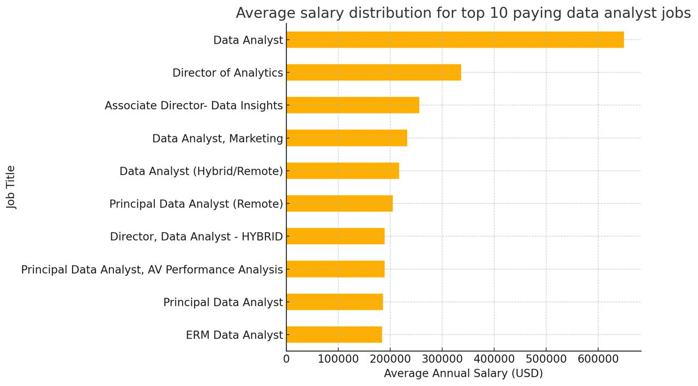
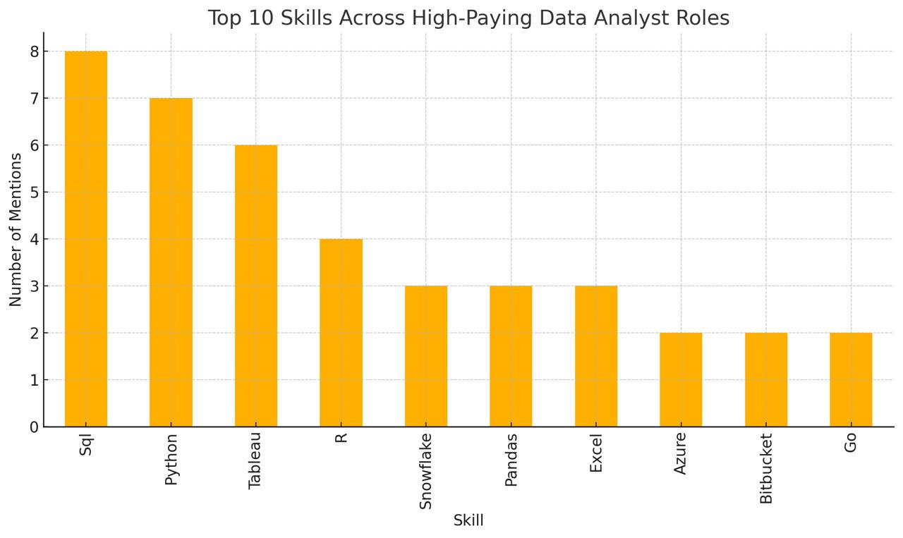

# 💼 SQL Portfolio Project – Data Analyst Job Market Insights
> A portfolio project built to improve SQL skills and analyze trends in the data analyst job market, using data from [Luke Barousse’s SQL Course](#)

## 📚 Table of Contents

- [🎯 Introduction](#🎯-introduction)
- [🧠 Background](#🧠-background)
- [🛠️ Tools I used](#🛠️-tools-i-used)
- [📊 The Analysis](#📊-the-analysis)
  - [1. Top Paying Data Analyst Jobs](#1-top-paying-data-analyst-jobs)
  - [2. Skills for Top Paying Jobs](#2-skills-for-top-paying-jobs)
  - [3. Most In-Demand Skills](#3-most-in-demand-skills)
  - [4. High-Value Technical Skills](#4-high-value-technical-skills)
  - [5. Most Optimal Skills to Learn](#5-most-optimal-skills-to-learn)
- [🧠 What I Learned](#🧠-what-i-learned)
- [🔍 Insights](#🔍-insights)
- [✅ Closing Thoughts](#✅-closing-thoughts)

## 🎯 Introduction
Welcome to my SQL portfolio project! This analysis focuses on the data analyst job market, exploring the best-paying roles, the most sought-after skills, and which skills offer both high demand and high salaries.

👉 Check out my SQL queries here: [project_sql folder](/project_sql/)

## 🧠 Background
This project was inspired by my desire to better understand the data analytics job landscape. I wanted to find out which skills are most lucrative and in-demand to better tailor my job search strategy.

The data comes from my [SQL course](https://lukebarousse.com/sql). It includes job titles, salaries, locations, and skills.

Key questions I set out to answer:

1. What are the top-paying jobs for data analysts?
2. What skills are required for these top-paying jobs?
3. What are the most in-demand skills for data analysts?
4. Which skills are associated with higher average salaries?
5. What are the most optimal skills to learn as a data analyst?

## 🛠️ Tools I used
- **SQL** – for querying and analyzing the data
- **PostgreSQL** – used as the database system
- **Visual Studio Code** – used to write and run SQL scripts
- **Git** - for version control and tracking changes in the project
- **GitHub** - for hosting and sharing the project online, as well as collaborating and showcasing work

## 📊 The Analysis

### 1. Top Paying Data Analyst Jobs
To identify the highest-paying roles, I filtered data analyst positions by average yearly salary and location, focusing on remote jobs. This query highlights the high paying opportunities in the field.

```sql
SELECT
    job_id,
    job_title,
    job_location,
    job_schedule_type,
    salary_year_avg,
    job_posted_date,
    name AS company_name
FROM
    job_postings_fact
LEFT JOIN company_dim
    ON job_postings_fact.company_id = company_dim.company_id
WHERE 
    job_title_short = 'Data Analyst' AND
    job_location = 'Anywhere' AND
    salary_year_avg IS NOT NULL
ORDER BY 
    salary_year_avg DESC
LIMIT 10
```
Here’s a summary of the top data analyst jobs in 2023:

- **Wide Salary Range:** The top 10 highest-paying data analyst roles have salaries ranging from $184,000 to $650,000, showcasing the substantial earning potential in this field.
- **Diverse Employers:** Companies such as SmartAsset, Meta, and AT&T are offering high-paying positions, demonstrating widespread demand for data analysts across various industries.
- **Variety in Job Titles:** The range of job titles spans from Data Analyst to Director of Analytics, highlighting the diversity of roles and specializations within data analytics.


*Bar graph showing the salary range of the top 10 highest-paid data analyst roles; ChatGPT generated this graph from my SQL query results*

### 2. Skills for Top Paying Jobs
This query identifies the skills required for the top 10 highest-paying Data Analyst jobs. By joining job postings with the skills data, we get a better understanding of which technical abilities are most valued in high-paying roles.
```sql
WITH top_paying_job AS (
    SELECT
        job_id,
        job_title,
        salary_year_avg,
        name AS company_name
    FROM
        job_postings_fact
    LEFT JOIN company_dim
        ON job_postings_fact.company_id = company_dim.company_id
    WHERE 
        job_title_short = 'Data Analyst' AND
        job_location = 'Anywhere' AND
        salary_year_avg IS NOT NULL
    ORDER BY 
        salary_year_avg DESC
    LIMIT 10
)

SELECT 
    top_paying_job.*,
    skills
FROM top_paying_job
INNER JOIN skills_job_dim
    ON top_paying_job.job_id = skills_job_dim.job_id
INNER JOIN skills_dim 
    ON skills_job_dim.skill_id = skills_dim.skill_id
ORDER BY
    salary_year_avg DESC
```
Here’s what we learned from the skills column across the top 10 highest‑paying Data Analyst roles:
 - **SQL** is ubiquitous, mentioned 8 times—every role expects strong database querying skills.
 - **Python** (7 mentions) and Tableau (6) follow closely, underlining the importance of scripting/programming and visualization expertise.
 - **Tableau** is also highly requested, with an impressive count of 6. Skills like **R**, **Snowflake**, **Pandas**, and **Excel** show different levels of demand.

 
 **Bar graph displaying the number of skills required for the top 10 highest-paying data analyst jobs; ChatGPT generated this graph from my SQL query results*

### 3. Most In-Demand Skills
This query reveals the most frequently requested skills in job listings for Data Analysts. It helps identify which skills are in highest demand across the job market.

```sql
SELECT 
    skills,
    COUNT(skills_job_dim.job_id) AS demand_count
FROM job_postings_fact
INNER JOIN skills_job_dim
    ON job_postings_fact.job_id = skills_job_dim.job_id
INNER JOIN skills_dim 
    ON skills_job_dim.skill_id = skills_dim.skill_id
WHERE 
    job_title_short = 'Data Analyst' AND
    job_work_from_home = TRUE
GROUP BY
    skills
ORDER BY
    demand_count DESC
LIMIT 5
```
Here’s an overview of the most in-demand skills for data analysts in 2023:

- **SQL** and **Excel** continue to be core skills, highlighting the importance of strong foundational abilities in data processing and spreadsheet management.  
- **Programming** and **visualization tools** such as **Python**, **Tableau**, and **Power BI** are critical, reflecting the growing need for technical expertise in data analysis, storytelling, and decision-making support.

| Skills   | Demand Cound  |
|----------|---------------|
| SQL      | 7291          |
| Excel    | 4611          |
| Python   | 4330          |
| Tableau  | 3745          |
| Power BI | 2609          |

*Table of demand for the top 5 skills in data analyst job postings*

### 4. High-Value Technical Skills
This query calculates the average salary for each skill required in Data Analyst job postings. It allows me to determine which skills are linked with higher salary potential.

``` sql
SELECT 
    skills,
    ROUND(AVG(salary_year_avg), 0) AS avg_salary
FROM job_postings_fact
INNER JOIN skills_job_dim
    ON job_postings_fact.job_id = skills_job_dim.job_id
INNER JOIN skills_dim 
    ON skills_job_dim.skill_id = skills_dim.skill_id
WHERE 
    job_title_short = 'Data Analyst' AND
    salary_year_avg IS NOT NULL AND
    job_work_from_home = TRUE
GROUP BY
    skills
ORDER BY
    avg_salary DESC
LIMIT 25
```
- **High Demand for Big Data & ML Skills:** Analysts skilled in big data (PySpark, Couchbase), machine learning (DataRobot, Jupyter), and Python libraries (Pandas, NumPy) earn top salaries, reflecting the value placed on data processing and predictive modeling.

- **Software Development & Deployment:** Knowledge of tools like GitLab, Kubernetes, and Airflow highlights the lucrative overlap between data analysis and engineering, focusing on automation and data pipeline efficiency.

- **Cloud Computing Expertise:** Familiarity with cloud tools (Elasticsearch, Databricks, GCP) shows the growing importance of cloud-based analytics, boosting earning potential in data analytics.

| Skills    | Average Salary $|
|-----------|-----------------|
| pyspark   | 208,172          |
| bitbucket | 189,155          |
| couchbase | 160,515          |
| watson    | 160,515          |
| datarobot | 155,486          |
| gitlab    | 154,500          |
| swift     | 153,750          |
| jupyter   | 152,777          |
| pandas    | 151,821          |
| elasticsearch| 145,000       |

*Table of the average salary for the top 10 paying skills for data analysts*

### 5. Most Optimal Skills to Learn
This query identifies the most strategic skills to learn as a Data Analyst. It combines both demand and salary data to find skills that are widely needed and well-paid.

``` sql
WITH skills_demand AS (
    SELECT 
        skills_dim.skill_id,
        skills_dim.skills,
        COUNT(skills_job_dim.job_id) AS demand_count
    FROM job_postings_fact
    INNER JOIN skills_job_dim
        ON job_postings_fact.job_id = skills_job_dim.job_id
    INNER JOIN skills_dim 
        ON skills_job_dim.skill_id = skills_dim.skill_id
    WHERE 
        job_title_short = 'Data Analyst' AND
        salary_year_avg IS NOT NULL AND 
        job_work_from_home = TRUE
    GROUP BY
        skills_dim.skill_id
),

 average_salary AS (
    SELECT 
        skills_job_dim.skill_id,
        ROUND(AVG(salary_year_avg), 0) AS avg_salary
    FROM job_postings_fact
    INNER JOIN skills_job_dim
        ON job_postings_fact.job_id = skills_job_dim.job_id
    INNER JOIN skills_dim 
        ON skills_job_dim.skill_id = skills_dim.skill_id
    WHERE 
        job_title_short = 'Data Analyst' AND
        salary_year_avg IS NOT NULL AND
        job_work_from_home = TRUE
    GROUP BY
        skills_job_dim.skill_id
)

SELECT
    skills_demand.skill_id,
    skills_demand.skills,
    demand_count,
    avg_salary
FROM
    skills_demand
INNER JOIN average_salary
    ON skills_demand.skill_id = average_salary.skill_id
WHERE 
    demand_count > 10
ORDER BY
    avg_salary DESC,
    demand_count DESC
LIMIT 25
```
| Skill ID | Skills     | Demand Count | Average Salary ($) |
|----------|------------|--------------|--------------------|
| 8        | Go         | 27           | 115,320            |
| 234      | Confluence | 11           | 114,210            |
| 97       | Hadoop     | 22           | 113,193            |
| 80       | Snowflake  | 37           | 112,948            |
| 74       | Azure      | 34           | 111,225            |
| 77       | BigQuery   | 13           | 109,654            |
| 76       | AWS        | 32           | 108,317            |
| 4        | Java       | 17           | 106,906            |
| 194      | SSIS       | 12           | 106,683            |
| 233      | Jira       | 20           | 104,918            |

*Table of 10 the most optimal skills for data analyst sorted by salary
## 🧠 What I Learned
During this project, I significantly improved my SQL skills and gained practical experience in working with job market data. Here are the key takeaways:

- **Advanced SQL Querying:** I learned to write complex SQL queries using WITH clauses to create temporary tables, which helped structure my code more clearly and efficiently.
- **Data Aggregation:** By applying functions like COUNT() and AVG() along with GROUP BY, I was able to summarize large datasets and extract meaningful trends.
- **Analytical Thinking:** I developed the ability to turn real-world business questions into structured queries, which provided actionable insights from raw data.

## 🔍 Insights

Based on the analysis I conducted, several notable patterns emerged:

- **Top Paying Data Analyst Jobs** Remote data analyst positions offer a wide salary range, with the top roles reaching up to $650,000 per year.
- **Skills for Top Paying Jobs:** SQL stands out as a critical skill in the highest-paying job listings, indicating its value for anyone aiming for top-tier roles.
- **Most In-Demand Skills:** SQL leads not only in compensation but also in demand, making it essential for those entering or advancing in the field.
- **High-Value Technical Skills:** Tools and languages such as Snowflake, Python, and R also showed strong demand and competitive salaries, especially in cloud and big data contexts.
- **Strategic Skill Development:** Combining salary and demand skills, it's clear that learning SQL alongside selected cloud or programming tools can maximize a data analyst’s market potential.

## ✅ Closing Thoughts
This project not only enhanced my technical proficiency with SQL but also deepened my understanding of the current job landscape for data analysts. The insights gained will help guide future skill-building efforts and highlight where to focus to stay competitive. Overall, the experience reinforced the value of continuous learning and adapting to evolving industry needs in data analytics.